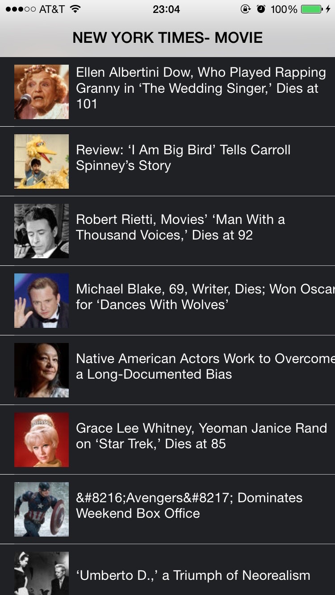

_Last Updated: Fri, Sept 19th, 2015  @ 14:25P_

##Feed Reader

Welcome!

Feed Reader implements New York Times' API to read the moives news. List news in the period of 10 days and enable to share them on the Facebook.

____

###REQUIREMENT

Swift 1.1 (Above 1.1 may have errors)

iOS above 8.2

____

###DESCRIPTION

This is an in-class project, which means it's finished within 2.5 hours.

We use the SQL query to fetch news from New York Times JSON Database, and show them in our app. Users can tap them to read the detail.

Also we implement the library for sharing to multi target, especially Facebook.

____

###Screenshot

____

###GROUP

 - [Wayne/ Wei Shan](https://github.com/ishawn)
 - [Dong Li](https://github.com/mewhuan)
 - [Lien-Jung Chang](https://github.com/ljc391)

____

###REFERENCE

 - [Alamofire](https://github.com/Alamofire/Alamofire)
 - [SwiftyJSON](https://github.com/SwiftyJSON/SwiftyJSON)
